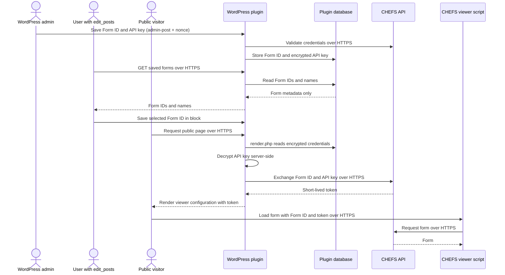

# Developer docs

This guide explains how to develop and maintain the `bcew-chefs-embed` WordPress plugin.

## Plugin overview

The plugin provides the `bcew-chefs-embed/chefs-form` dynamic block. It stores a selected CHEFS Form ID in the block content, while the corresponding API key is stored securely in the plugin settings.

The block does not embed a form directly in saved post content. WordPress renders a mount point, and the frontend script requests a short-lived CHEFS token before loading the CHEFS form viewer.

## Local development

Run commands from the monorepo root.

### Install dependencies

```shell
pnpm install
npx nx run bcew-chefs-embed:composer-install
```

The Composer target installs the plugin's PHP development dependencies. The plugin requires PHP 7.4.

### Build and start WordPress

```shell
npx nx run bcew-chefs-embed:build
npx nx run bcew-chefs-embed:wp-env-start
```

The local site is available at `http://localhost:9012`. WordPress Admin is available at `http://localhost:9012/wp-admin`. The CHEFS settings page is available at `http://localhost:9012/wp-admin/admin.php?page=bcew-chefs-embed-settings`.
The test environment uses port `9013` and is used by the Playwright targets. It is separate from the normal development site on port `9012`.

The `wp-env` lifecycle script activates the plugin after the environment starts. Build the assets again after changing block JavaScript, styles, or metadata.

### CHEFS authentication mock

The package-local `wp-env` configuration enables `BCEW_CHEFS_E2E_MOCK` only for
the Playwright test WordPress container on port `9013`. This installs a
server-side `pre_http_request` filter for the CHEFS authentication endpoint, so
automated tests do not call the live CHEFS service.

The mock accepts only the explicit Form ID and API key pairs used by the E2E
fixtures. An unknown Form ID returns a `404` `Bad formId` response, and a known
Form ID with a different API key returns a `403` response. This is important
for manual testing: arbitrary credentials must fail during the settings save,
rather than being saved and failing later with an invalid gateway token in the
block editor.

The development WordPress site on port `9012` does not enable the mock, so
developers can manually test real Form ID and API key combinations against
CHEFS. The mock is also not enabled in production. Do not add real API keys to
the fixture allowlist or commit them anywhere in the repository.

### Stop or reset WordPress

```shell
npx nx run bcew-chefs-embed:wp-env-stop
npx nx run bcew-chefs-embed:wp-env-clean
```


## Block architecture

The block metadata is defined in `src/chefs-form/block.json`. Its registered name is `bcew-chefs-embed/chefs-form`, its category is `widgets`, and its editor icon is the WordPress `media-document` Dashicon.

The block has one persisted attribute:

```json
{
	"formId": {
		"type": "string",
		"default": ""
	}
}
```

The API key and runtime token are never block attributes.

### Data flow

The runtime path below shows the target server-rendered token flow from
DSWP-1232. The browser receives a short-lived token so the CHEFS viewer can
load the form, but it never receives the stored API key.



Administrators manage Form IDs and API keys through nonce-protected
`admin-post` actions. Users with `edit_posts` can retrieve saved Form IDs and
select one in the block editor. Public visitors can load the published form
with the short-lived token produced during server rendering, but the API key
remains encrypted at rest and is only decrypted inside WordPress for the
server-to-server CHEFS token exchange.

### Editor flow

1. `src/chefs-form/edit.js` requests the saved forms from the `forms` REST route.
2. The stored CHEFS titles are displayed in the block sidebar.
3. Selecting a title updates the persisted `formId` attribute with the UUID.
4. If the selected Form ID is deleted by an administrator, the editor clears the stale selection.
5. The editor preview uses the runtime configuration endpoint and CHEFS viewer used by the published block.

The editor preview is provided by `src/chefs-form/components/chefs-form-preview.js`. It uses the same runtime configuration endpoint as the published block and loads the CHEFS viewer through `src/chefs-form/utils/ensure-chefs-form-viewer.js`.

### Frontend flow

`src/chefs-form/render.php` sanitizes the Form ID and renders the block wrapper with a `data-form-id` attribute. It renders an empty-state message when no Form ID is selected. It does not render an API key or token.

`src/chefs-form/view.js` runs in the browser after the page loads. For each block, it:

1. Finds the block wrapper and reads the Form ID from its `data-form-id` attribute.
2. Requests `/wp-json/bcew-chefs-embed/v1/embed-config?formId=<form-id>`. This request goes to WordPress, where the plugin retrieves the encrypted API key and exchanges it with CHEFS for a short-lived access token. The API key is never sent to the browser.
3. Loads the CHEFS form viewer web component from the CHEFS service if it is not already available on the page.
4. Creates the viewer inside the block's mount element and passes it the short-lived token and CHEFS base URL returned by WordPress. The visitor can then interact with the live form.
5. Listens for the viewer's `formio:submitDone` event. When submission succeeds, it removes the viewer and displays the configured confirmation message, or the generic success message when no custom message is configured.
6. Listens for the viewer's `formio:error` event. When CHEFS reports a submission error, it displays the error above the form and keeps the form available so the visitor can try again.

If the configuration request or viewer script fails before the form loads, the block displays a load error in place of the form.

## REST API

The plugin registers routes under `/wp-json/bcew-chefs-embed/v1`.

### Get saved forms

```text
GET /wp-json/bcew-chefs-embed/v1/forms
```

The block editor uses this route to populate its form-title selector. It
requires the current user to have the `edit_posts` capability and returns saved
form titles plus their IDs. Unauthorized requests receive a `403` response.

The route is registered in `bcew-chefs-embed.php` and handled by
`bcew_chefs_embed_get_saved_forms()`.

### Get embed configuration

```text
GET /wp-json/bcew-chefs-embed/v1/embed-config?formId=<form-id>
```

The editor preview and published frontend use this route. It is public because an anonymous visitor must be able to load a published form. The route:

1. Looks up the configured Form ID.
2. Decrypts its stored API key on the server.
3. Sends a server-to-server Basic Authentication request to CHEFS.
4. Returns the short-lived token, CHEFS base URL, and configured confirmation message.

The API key is not included in the response. Omitting the required `formId` parameter returns `400`; an unknown or undecryptable Form ID returns `404`. Failures contacting CHEFS or invalid CHEFS responses return an error response from the gateway/authentication path.

The route is registered and handled by `src/EmbedConfigController.php`.

## Security and credentials

The settings page requires the `manage_options` capability. Form save, deletion, and confirmation actions use WordPress admin-post handlers with nonce validation.

API keys are encrypted before they are stored by `src/CredentialsManager.php`. `src/Crypto.php` prefers libsodium and falls back to OpenSSL AES-256-GCM. The encryption key is derived from the WordPress authentication salts, so encrypted values depend on the WordPress installation's salts.

Implementation safeguard: do not decide whether a Form ID is new by calling `get_by_form_id()`. It returns `null` for both a missing row and an undecryptable key, while `save()` can still update an existing row. Use `CredentialsManager::form_exists()` to check for the row without decrypting the stored key. A valid replacement key for an existing row must preserve the saved form name and confirmation and report an update, even when the old key cannot be decrypted.

During form rendering, the server decrypts the API key and uses it only for the CHEFS token exchange. Basic Authentication is server-to-server. The API key remains server-side and is not included in block attributes, rendered HTML, frontend source, or REST responses. The short-lived token is intentionally returned by `embed-config` and the frontend assigns it to the CHEFS viewer's `auth-token` attribute so the browser can load the form. The token is not stored in the block's persisted attributes.

Do not commit API keys, add them to source code, or expose them in client-side code. Use the CHEFS settings page for configured credentials and use non-production credentials for local testing.

When moving a database between environments, remember that different WordPress salts cannot decrypt the same stored API-key ciphertext. A database-only migration may require the credentials to be entered again.

## Testing and verification

Run the build and test targets from the monorepo root:

```shell
npx nx run bcew-chefs-embed:build
npx nx run bcew-chefs-embed:test-integration
npx nx run bcew-chefs-embed:test-e2e
npx nx run bcew-chefs-embed:test-screenshot
```

Use `test-screenshot-generate` when updating approved screenshot baselines. The browser tests use the test environment on port `9013`.

### Manual smoke test

1. Start the environment with `npx nx run bcew-chefs-embed:wp-env-start`.
2. Open the development site at `http://localhost:9012` and confirm WordPress loads. Use port `9012` for manual tests with real CHEFS credentials because this site connects to the real CHEFS authentication endpoint. Do not use the Playwright test site on port `9013`, where CHEFS authentication is mocked.
3. Open the CHEFS settings page as an administrator and save a Form ID and API key.
4. Create a post and insert the CHEFS Form block.
5. Confirm the saved Form ID appears in the block sidebar.
6. Select the Form ID and confirm the editor preview loads when valid CHEFS credentials and network access are available.
7. Publish the post and open it as an anonymous visitor.
8. Confirm the form loads through `embed-config`.
9. Verify that the CHEFS API key is not present in the page source, frontend code, or REST response. The REST response may contain the short-lived token used to load the form.

The local WordPress environment can be started without live CHEFS credentials, but loading and submitting a real form on port `9012` requires valid credentials and access to the CHEFS service.

## Related documentation

For administrator setup and content-authoring instructions, see [User docs](./user-docs).

For the plugin overview and local environment summary, see [Plugin overview](./index).
