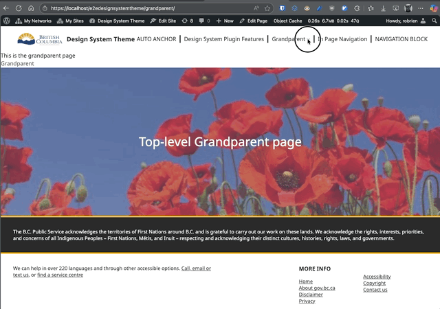
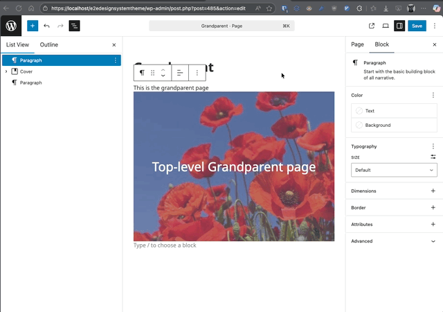
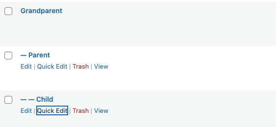

# BreadCrumb Block

## Overview

The BreadCrumb Block outputs a trail representing the current view (for example, Home / Parent / Child). It is a dynamic, server-rendered block, so no breadcrumb HTML is stored in post content.

## Key Features

- Dynamic server-side rendering (PHP `render.php`)
- Supports singular content, the posts index, search results, archives, and 404 pages
- Includes ancestors for hierarchical posts and pages
- Uses `/` as the separator
- Renders the current item as plain text
- Shows a static placeholder preview in the editor
- RTL-compatible styles (separate compiled CSS)

## When to Use

Place the block near the top of templates or in a Header/Content template part to improve navigation clarity and orientation. It is especially useful for large sites with nested pages.

### Using Breadcrumbs to navigate

## Editing Experience

In the Site Editor or content editor, the block shows the static example Home / Parent / Child. The current context and hierarchy appear only on the front end. The block has no breadcrumb-specific settings.

## Front-End Rendering

For singular hierarchical content, the PHP render callback assembles:

1. Home
2. Intermediate ancestors
3. The current item as plain text

For non-hierarchical singular content, the posts index, search results, archives, and 404 pages, it renders Home followed by the current context. Home and ancestors are links; the current item is not linked. The breadcrumb is not displayed on the front page.

## Usage Examples

### Add to a Template

1. Appearance > Editor.
2. Open the relevant template or create a Template Part such as Header.
3. Insert “BreadCrumb” block below site header.
4. Save and view the template on the front end.

### Quick Demo Hierarchy

Create three Pages:

- Grandparent (top level)
- Parent (set Parent to Grandparent)
- Child (set Parent to Parent)
View Child page with the block placed in the Page template.

## Styling & Customization (custom CSS)

- Target wrapper selector: `.dswp-block-breadcrumb__container`
- Separator element: `.dswp-breadcrumb-separator`
- Provide overrides in a theme stylesheet or a global style variation.
- RTL adjustments handled by generated `style-index-rtl.css`.

## Accessibility

- Uses a navigation landmark with an accessible label.
- Each ancestor is a link; the current item is plain text.
- Keep link text concise; page title changes automatically propagate.

## Performance

Dynamic rendering avoids recalculating trails client-side. Minimal markup; styles are precompiled.

## Limitations

- No built-in schema markup (can be added in theme if desired).
- Archives show the current archive title but not a taxonomy ancestor path.

## Best Practices

- Avoid placing multiple breadcrumb blocks on the same template.
- Keep divider style consistent site-wide.
- Do not manually duplicate breadcrumb links in body content.

## Troubleshooting

- Breadcrumbs missing: Confirm the block is present in the template used by the current view.
- Wrong hierarchy: Verify parent settings for each Page.
- Breadcrumb absent on the front page: This is expected behavior.
