# Patterns Overview

All patterns are designed to be responsive, mobile-friendly, accessible, and optimized for performance. The goal is to allow you to easily drag and drop any number of these patterns in any order on a page without needing to modify any code or block settings—simply update the content and colors as needed.  You should be able to create a multi-page site using any combination of these patterns, without the need to develop new ones.

If you're new to WordPress's Block Patterns, check out the [WordPress's Block Patterns Guide](https://wordpress.com/support/wordpress-editor/block-pattern/)

## BC Gov Logo Light

This is an experimental pattern that is not yet ready for use.

## Horizontal Card with Large Image

Full-width layout with flexible content area and optional button component.

Standard layout:
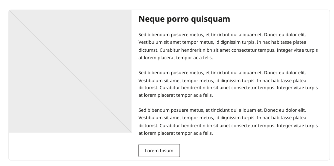

Example implementation:
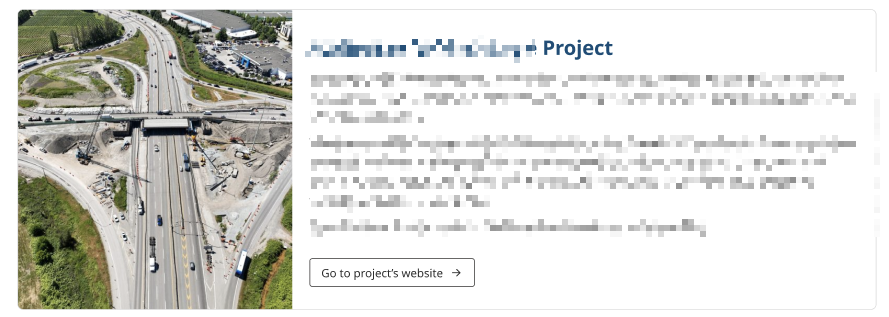

Variation Example right:
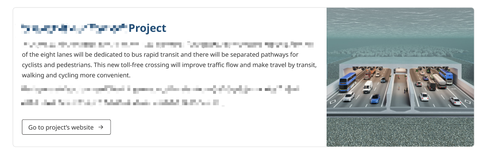

## Vertical Cards

Flexible card layout that supports both images and icons.

Standard layout:
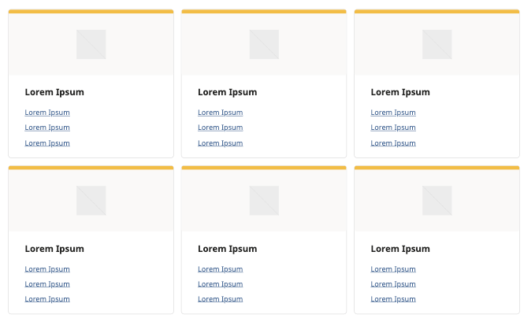

Example implementation:
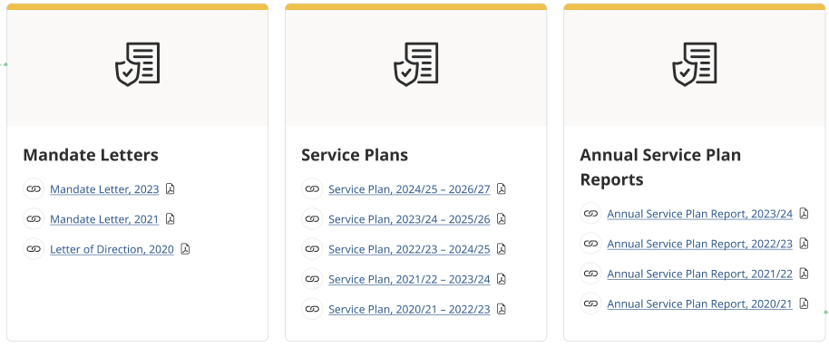

## Hero Image with Title

Main banner images with text overlay

Standard hero banner:
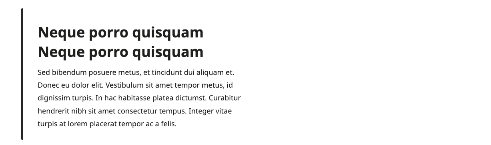

Example implementation:

## Secondary Hero

Smaller banner sections with compact layout

Standard layout:

Example implementation:

## Heading with Paragraphs

Text content with styled heading

Standard layout:
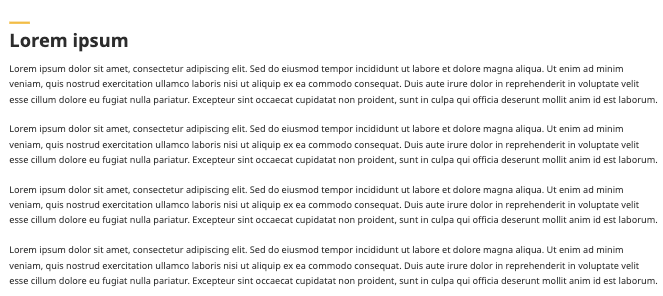

## Image & Text

Image and text content blocks with flexible layout options

Standard layout:
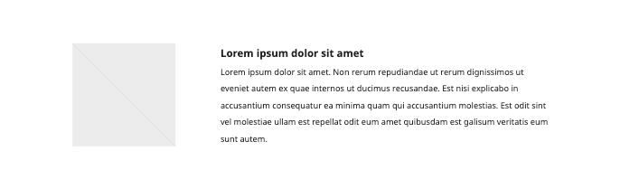

Example implementation:
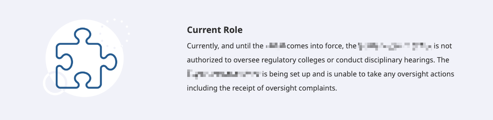

Variation Example right:
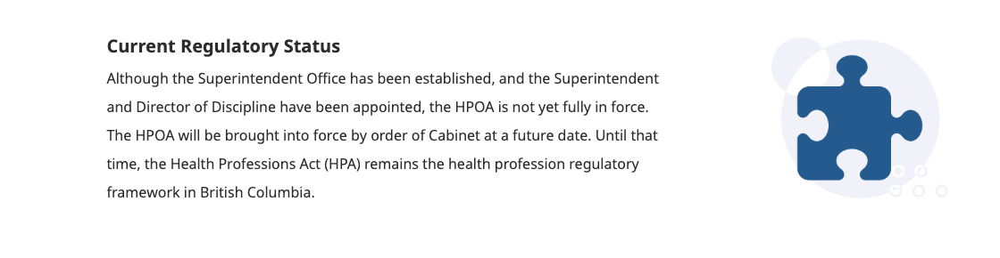

## Team Pattern

Staff and team member displays with contact information

Standard layout:
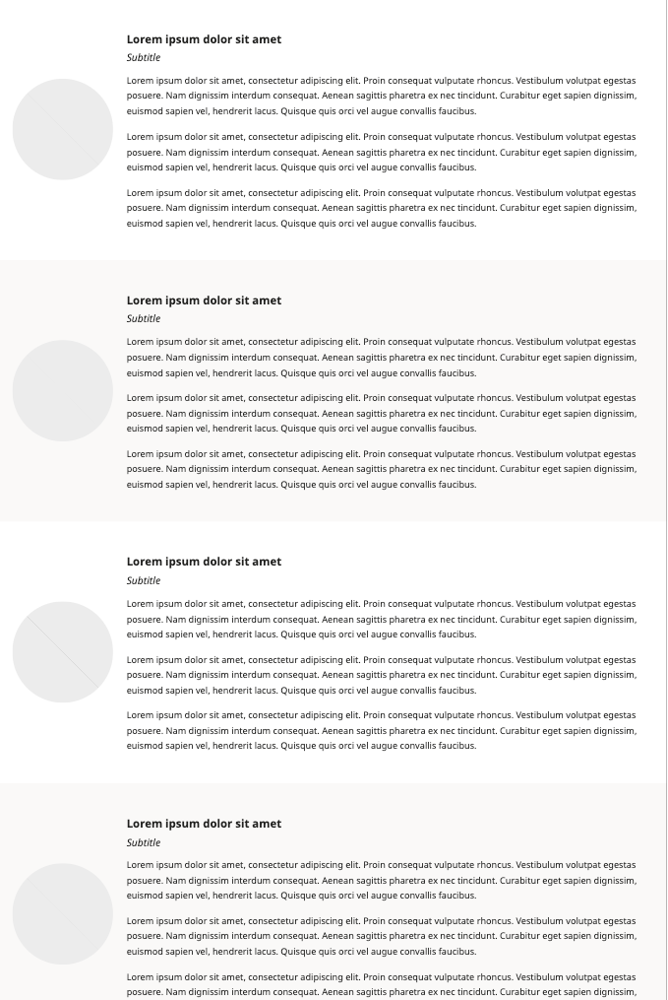

Example implementation:
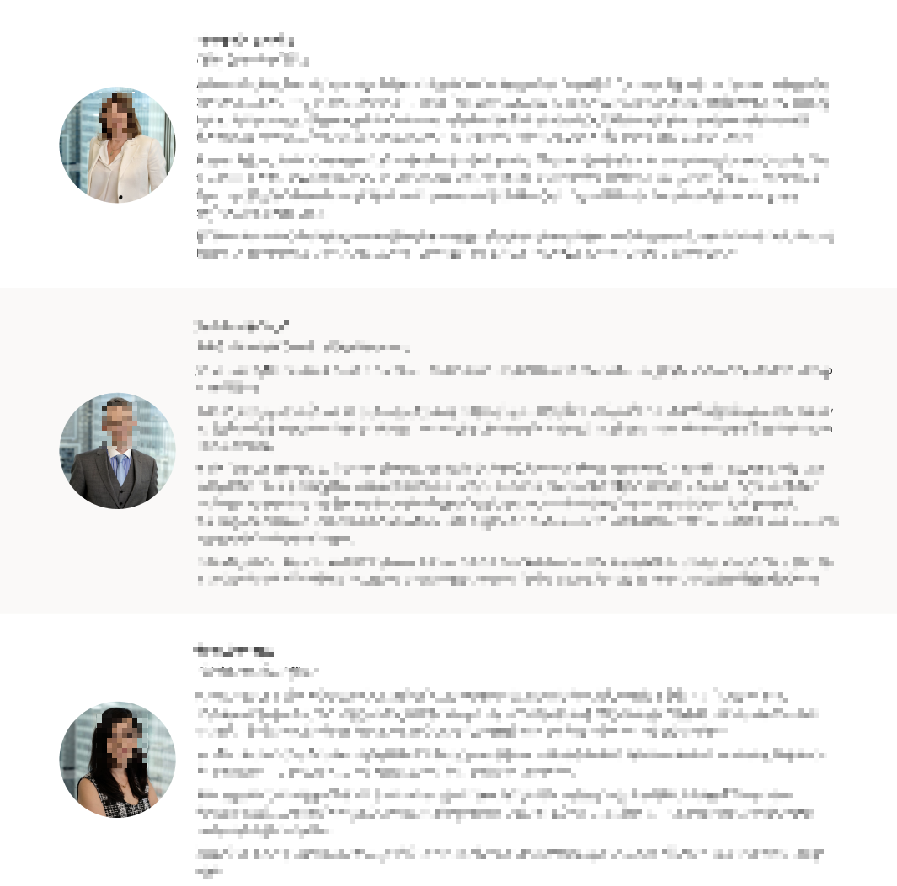

## Information Contact Socials

Contact information

Standard layout:
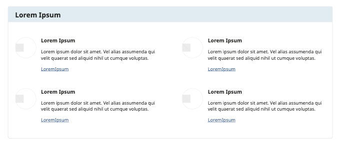

Example implementation:
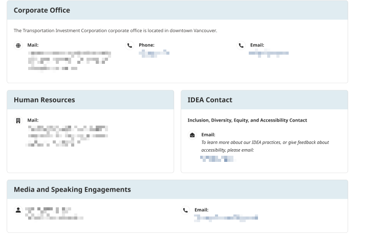

## Icon with Excerpt

Short content blocks with icons

Standard layout:
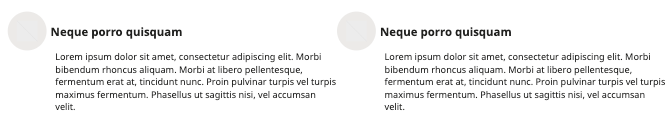

Example implementation:
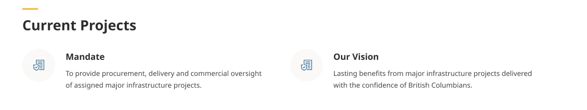

## Card with Hyperlink List

Card layout with icon and title at the top

Standard layout:
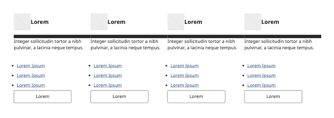

Example implementation:
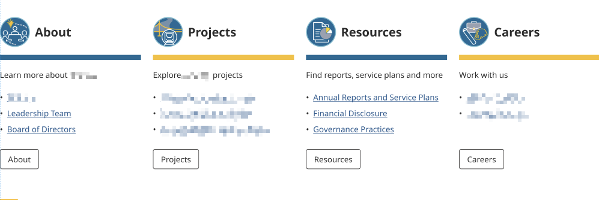

## Best Practices

1. **Pattern Selection**
   - Choose patterns based on content type
   - Maintain consistency across pages
   - Consider mobile responsiveness (How patterns look on mobile devices when stacked on top of each other)

2. **Content Population**
   - Replace all placeholder text
   - Use appropriate image sizes

3. **Accessibility**
   - Include [alt text for images](https://www.w3.org/TR/WCAG20-TECHS/H37.html)
   - Maintain color [contrast](https://www.w3.org/WAI/WCAG22/Understanding/contrast-minimum.html)
   - Ensure proper [heading structure](https://www.w3.org/WAI/tutorials/page-structure/headings/)

4. **Performance**
   - [Optimize images](https://wordpress.com/support/media/image-optimization/) before upload
   - Don't overload pages with patterns
   - Consider load times

